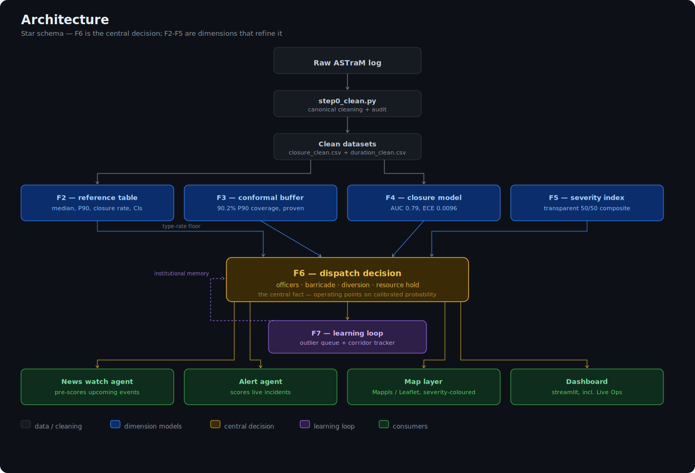

# 🚦Event-Impact & Resource Recommendation Engine

### Bengaluru Traffic Police — Flipkart GRiD Round 2

> **Problem Statement:**
> How can historical and real-time data be used to forecast event-related traffic impact and recommend optimal manpower, barricading, and diversion plans?

---

## What this system does

This project is a decision-support engine for Bengaluru Traffic Police that:

- Forecasts the operational impact of planned and live events
- Predicts road-closure likelihood and expected clearance time
- Recommends officers, barricades, diversions, and hold duration
- Learns from every completed event through a post-event review loop
---

## Explore the Project

| Resource | Description |
|-----------|-------------|
| [LIVE Demo](https://btp-dispatch-engine-sam.streamlit.app/) | Interactive dashboard with forecasting, dispatch recommendations, map visualization, and learning workflows. |
| Demo Video | End-to-end walkthrough of the system, architecture, and key features. |
| Technical Report | Detailed methodology, modeling decisions, evaluation results, and implementation details. |

- [LIVE Demo](https://btp-dispatch-engine-sam.streamlit.app/)
- [Demo Video](https://drive.google.com/file/d/1q_LZ8K7uWSphxxnBHIiVT_lgM8YVPTfS/view?usp=sharing)
- [Technical_Report.pdf](Technical_Report.pdf) | [Google Drive](https://drive.google.com/file/d/1q_LZ8K7uWSphxxnBHIiVT_lgM8YVPTfS/view?usp=sharing) 
---
## How this answers the problem statement

The brief names three gaps. Here is where each is solved:

| The brief's pain point | Where we solve it | What you get |
|---|---|---|
| ❌ *"Event impact is not quantified in advance"* | **News Watch agent** + F2/F3/F4/F5 | every upcoming event pre-scored for severity, closure %, and clearance time *before it happens* |
| ❌ *"Resource deployment is experience-driven"* | **F6 dispatch** + **Alert agent** | officers / barricade / diversion recommended from calibrated probabilities, with tunable operating points |
| ❌ *"No post-event learning system"* | **F7 learning loop** | an outlier review queue + corridor tracker that turns every closed event into institutional memory |

"Historical **and** real-time" is handled by two agents sharing one engine: the **News agent** scores *future* events from historical analogues; the **Alert agent** scores *live* incidents through the per-event model.

---

## 🔍 Three Things Worth Knowing

1. **Data beats intuition.** Low-priority events close roads 12.1% of the time versus 5.9% for High-priority events. Operator-assigned priority reflects dispatch urgency, not actual disruption — so the system models disruption directly instead of relying on the priority label.

2. **Every uncertainty claim is verified.** The P90 clearance buffer achieves 90.2% coverage on held-out data (split-conformal), while the closure model is calibrated to an ECE of 0.0096. Both can be independently reproduced using `verify_accuracy.py`.

3. **Simplicity won.** A gradient-boosted clearance model was built, tested, and rejected because it underperformed a transparent per-type median baseline (MedAE 31.4 vs 29.0 minutes). The simpler model shipped, and the discarded model remains in the repository as evidence.

## ⭐ Architecture 
The system is organized as a star schema centered on a single dispatch decision, with timing, closure, severity, and learning modules acting as independent evidence sources.



**Why a star schema fits:** F6 is the one decision everything exists to produce. F2–F5 are independent dimensions that refine that decision from different angles (timing, closure, severity); F7 is the slowly-growing fact-history; the agents and dashboard are read-only consumers. Nothing reaches around F6 — the engine never imports a map or a UI.

<details>
<summary>Text version (if the image doesn't render)</summary>


The system is a **star schema**: the **F6 dispatch decision** is the central fact, and every model is a dimension feeding into it. Inputs flow in from the left; the two agents and the dashboard consume the decision on the right.

```
                          DIMENSIONS (models)                       FACT                 CONSUMERS
   ┌───────────────┐
   │  RAW ASTraM   │
   │  incident log │
   └───────┬───────┘
           │ step0_clean.py  (canonical cleaning + audit)
           ▼
   ┌───────────────┐        ┌──────────────────────┐
   │ closure_clean │───────►│  F2  reference table  │  median clearance, P90,
   │ duration_clean│        │  (the transparent     │  closure rate + Wilson CIs
   └───────┬───────┘        │   anchor predictor)   │
           │                └───────────┬──────────┘
           │                            │
           │                ┌───────────▼──────────┐
           │                │  F3  conformal buffer │  calibrated P90 clearance
           │                │  (90.2% coverage)     │ ──────────┐
           │                └───────────┬──────────┘           │
           │                            │                       │       ┌──────────────────────┐
           ├───────────────►┌───────────▼──────────┐           ├──────►│                      │
           │                │  F4  closure model    │  per-event│       │   ⭐  F6  DISPATCH    │
           │                │  (AUC 0.79, ECE .009) │  closure  ├──────►│      DECISION        │
           │                └───────────┬──────────┘  prob      │       │  (the central fact)  │
           │                            │                       │       │                      │
           │                ┌───────────▼──────────┐           │       │  officers · barricade│
           └───────────────►│  F5  severity index   │  High/Med/├──────►│  · diversion · hold  │
                            │  (transparent 50/50)  │  Low      │       │                      │
                            └──────────────────────┘           │       └───────┬──────┬───────┘
                                                                │               │      │
                                        ┌───────────────────────┘               │      │
                                        │                                        │      │
                            ┌───────────▼──────────┐                            │      │
                            │  F7  learning loop    │◄───────────────────────────┘      │
                            │  outlier queue +      │   every dispatched event           │
                            │  corridor tracker     │   logs back in                      │
                            └──────────────────────┘                                     │
                                                                                          │
        CONSUMERS that read the F6 fact: ────────────────────────────────────────────────┤
                                                                                          ▼
         📡 News Watch agent     →  pre-scores UPCOMING events (type-level analogue)
         🚨 Alert agent          →  scores LIVE incidents (per-event F4 + floor)
         🗺️  Mappls / Leaflet map →  plots the dispatch decision geographically
         📊 Streamlit dashboard  →  8 tabs incl. the Live Ops command center
```

**Why a star schema fits:** F6 is the one decision everything exists to produce. F2–F5 are independent dimensions that refine that decision from different angles (timing, closure, severity); F7 is the slowly-growing fact-history; the agents and dashboard are read-only consumers. Nothing reaches around F6 — the engine never imports a map or a UI.

</details>

---

## 📁 Project structure

```
btp-dispatch-engine/
│
├── app.py                  ◄─ START HERE.  streamlit run app.py
├── verify_accuracy.py      ◄─ independent audit: recomputes every metric from scratch
├── README.md               this file
├── GRiD_Final_Strategy.md  full methodology write-up
├── requirements.txt        streamlit, pandas, numpy, scikit-learn, pydeck
│
├── engine/                 the F-pipeline — run in numeric order, each reads the last
│   ├── step0_clean.py          raw log → two canonical datasets (+ audit log)
│   ├── f2_reference_table.py   per-type median / P90 / closure rate + Wilson CIs
│   ├── f3_duration_model.py    the GBM that was TESTED AND DROPPED (kept as evidence)
│   ├── f3b_calibration_resolution.py   diagnoses why the GBM's P90 was miscalibrated
│   ├── f3_buffer_final.py      the shipped conformal P90 buffer (90.2% coverage)
│   ├── f4_closure_model.py     calibrated closure-probability model (AUC 0.79)
│   ├── f5_severity.py          transparent severity composite (50% duration / 50% closure)
│   ├── f6_dispatch.py          ⭐ the dispatch decision + reusable dispatch_for_row()
│   └── f7_learning_loop.py     outlier review queue + corridor tracker
│
├── agents/                 two consumers of the engine, runnable standalone
│   ├── news_agent.py           📡 pre-scores UPCOMING events from analogues
│   └── alert_agent.py          🚨 scores LIVE incidents through the full engine
│
├── map/                    the geographic layer (thin, swappable)
│   ├── mappls_layer.py         dispatch schema → GeoJSON → map HTML
│   ├── dispatch_map_mappls.html    production render (needs your Mappls key)
│   ├── dispatch_map_preview.html   no-key Leaflet preview — open this to see it NOW
│   └── dispatch_markers.geojson    the standard-format marker data
│
└── data/                   everything the scripts read & write
    ├── Astram_..._anonymized.csv   the raw input log (8,173 rows)
    ├── closure_clean.csv           full population, for the closure model
    ├── duration_clean.csv          real-close events, for the timing models
    ├── reference_table.csv         F2 output
    ├── conformal_buffer.csv        F3 output
    ├── f4_closure_model.pkl        F4 trained model bundle
    ├── f3_duration_model.pkl       the dropped GBM (evidence)
    ├── severity_by_type.csv        F5 output
    ├── dispatch_schema.csv         F6 output — 8,170 dispatch records
    ├── outlier_queue.csv           F7 output — ranked anomalies
    ├── corridor_ranking.csv        F7 output — corridor hypotheses
    ├── news_prescored.json         News agent output
    └── review_log.csv              Alert agent output (feeds F7)
```

---

## ▶️ Run it


### Clone the repository

```bash
git clone https://github.com/samsadar236/btp-dispatch-engine.git
cd btp-dispatch-engine
```

### Install dependencies

```bash
pip install -r requirements.txt
```

### Launch the command center

```bash
streamlit run app.py
```

The dashboard opens locally in your browser.

### What to look at first

Open the **🎯 Live Ops** tab.

This is the entire operational workflow in one screen:

```text
Detect Event
      ↓
Forecast Impact
      ↓
Dispatch Resources
      ↓
Map Visualization
      ↓
Review & Learn
```

You can:

- Scan upcoming events that have been pre-scored by the News Watch agent
- Trigger live incidents through the Alert agent workflow
- Inspect predicted closure probability, severity, and clearance estimates
- Review generated deployment recommendations (officers, barricades, diversions, hold time)
- Visualize dispatched events on the map
- Watch reviewed incidents flow back into the learning loop


### Run the agents directly

The dashboard consumes the same engine used by the standalone agents.

#### News Watch Agent

Pre-scores upcoming events from historical analogues and generates deployment recommendations before the event occurs.

```bash
python agents/news_agent.py
```

#### Alert Agent

Scores a live incident through the calibrated closure model and emits an officer-facing dispatch recommendation.

```bash
python agents/alert_agent.py
```

### Verify every reported metric

Every accuracy claim in this repository can be independently reproduced.

```bash
python verify_accuracy.py
```

The script rebuilds the evaluation metrics from the saved artifacts and prints:

- Closure-model discrimination (AUC)
- Calibration quality (ECE)
- Conformal coverage
- Duration-model error statistics

No metrics are hard-coded into the dashboard or README.

---

## 🤖 The AI Agents — What They Do, and How They Work

The system ships two agents that share the same core engine but serve different time horizons.

### News Watch Agent (`agents/news_agent.py`)

**Job:** estimate an event’s impact before it happens.

This agent handles the pre-event case, where exact location, assigned officer, and observed duration are not yet available. It uses a type-level historical analogue: it maps a detected event to its nearest event-cause in the data, then uses that event type’s median clearance time, closure rate, severity tier, and conformal P90 from the reference table. The output is a pre-deployment plan with severity, expected closure probability, clearance estimate, and recommended officers, barricading, and diversion level.

### Alert Agent (`agents/alert_agent.py`)

**Job:** score a live incident immediately and emit an officer-facing alert.

This agent handles the live case, where the report already includes usable features such as cause, vehicle type, police station, corridor, and time. It uses the calibrated per-event closure model, applies the conservative deployment floor, and generates the final dispatch recommendation. It then formats the alert and logs the incident to `review_log.csv` for the learning loop.

### Core pipeline vs deployment hooks

The core scoring logic runs locally and does not require API keys. Any live feed ingestion or LLM-based parsing is treated as an optional deployment-time integration, not a dependency of the model itself.

This is intentional: the project demonstrates the decision logic and scoring pipeline end to end, while keeping external integrations separable and easy to swap in later.

---

## 📂 What every file does — in detail

### Entry points (repo root)

- **`app.py`** — the Streamlit dashboard, 8 tabs. Overview (headline metrics), **Live Ops** (the integrated command center chaining the whole pipeline), Live Assessment (probe any event manually), Reference Table, Calibration (the credibility tab with the live reliability curve), Learning Loop, Map (pydeck), Explore. Reads only the artifacts in `data/` — never imports the engine scripts, so the UI is fully decoupled.
- **`verify_accuracy.py`** — an independent auditor. Recreates the exact held-out test splits used in training (same random seed) and **recomputes** AUC, ECE, conformal coverage, and MedAE from scratch against the saved artifacts. Nothing is read from a results file, so it can't go stale. This is your "prove it" button for judges.

### `engine/` — the F-pipeline (run in order)

- **`step0_clean.py`** — runs first. Turns the raw 8,173-row log into two canonical datasets with a printed audit trail: `closure_clean.csv` (full population, for the closure model) and `duration_clean.csv` (real-close events in (0, 24h], for timing). Key honest decision: it drops "rescue" rows (`status==closed` with no close timestamp — fabricated durations) rather than blanket-rejecting everything a bot touched.
- **`f2_reference_table.py`** — the **primary, transparent predictor**. One row per event cause: median clearance, de-contaminated P90, closure rate with Wilson 95% confidence intervals, and a reliability tier (reliable / directional / sparse). Every other module leans on this; an operator can read it directly.
- **`f3_duration_model.py`** — a gradient-boosted quantile regressor for clearance time. **Included specifically because it was tested and dropped** — its P50 (MedAE 31.4) didn't beat F2's median (29.0) and its P90 was miscalibrated. Kept in the repo as evidence of honest model selection.
- **`f3b_calibration_resolution.py`** — the diagnostic that investigated *why* the GBM's P90 under-covered, leading to the conformal approach instead.
- **`f3_buffer_final.py`** — the **shipped** clearance-uncertainty solution: a split-conformal P90 buffer with a proven 90.2% marginal coverage. Splits types into "calibrated" (well-behaved, high-volume) and "review" (long-tail types whose recorded tail is ticket-lifecycle noise, not real clearance — dispatched on median and routed to F7).
- **`f4_closure_model.py`** — the **calibrated road-closure probability** model ("does this need barricades/diversions?"). Trained on the full population (closure flag is set at creation, so no selection bias), isotonic-calibrated, validated with a reliability table + Brier + ECE. AUC 0.79 vs 0.74 baseline; ECE 0.0096.
- **`f5_severity.py`** — a single severity class (High/Med/Low) per event, **openly constructed not learned**: `0.5 × normalize(F2 median duration) + 0.5 × F2 closure rate`. The 50/50 blend is justified because duration and closure are nearly orthogonal at the type level (ρ ≈ −0.04).
- **`f6_dispatch.py`** — ⭐ **the central decision**. Converts the engine outputs into a per-event recommendation: officer count, barricade, diversion, resource-hold time. Because the data has no manpower ground truth, this is an openly-configurable rules scaffold (every constant in `CONFIG`) — but the barricade/diversion thresholds are reported as **operating points** on F4's calibrated probability (deploy-rate / recall / precision), not arbitrary magic numbers. Exposes `dispatch_for_row()`, reused by both agents.
- **`f7_learning_loop.py`** — the post-event learner, two products of deliberately different evidential strength: (1) an **outlier review queue** — events that ran past their peer cohort's IQR upper fence, ranked by excess, with ticket-artifacts sorted to the bottom; (2) a **corridor tracker** with Wilson CIs, presented honestly as *directional hypotheses* because none are yet statistically distinguishable from the global rate.

### `agents/` — covered in detail in the section above.

### `map/`

- **`mappls_layer.py`** — a thin adapter: dispatch schema → standard GeoJSON (severity-colored, with the dispatch recommendation in each popup) → map HTML. Reads `dispatch_schema.csv` from `data/`, writes its renders here. The renderer is swappable: it produces both a **Mappls** production render (needs your key) and a **no-key Leaflet** preview of the identical GeoJSON.
- **`dispatch_map_preview.html`** — open this directly in a browser to see the map render *right now*, no key required.
- **`dispatch_map_mappls.html`** / **`dispatch_markers.geojson`** — the production render and the underlying marker data.

### `data/` — every input and artifact, listed in the structure tree above.

---

## ✅ Reproducibility

Every script resolves its data path relative to its own location (into `data/`), so the whole pipeline runs from any clone, regardless of working directory:

```bash
python engine/step0_clean.py && python engine/f2_reference_table.py && python engine/f3_buffer_final.py \
 && python engine/f4_closure_model.py && python engine/f5_severity.py && python engine/f6_dispatch.py \
 && python engine/f7_learning_loop.py && python map/mappls_layer.py
```

The raw ASTraM CSV ships in `data/`, so this regenerates every artifact from scratch. Then `python verify_accuracy.py` confirms the numbers.

---
## 🧾Modeling Decisions & Limitations

- **Impact over congestion.** The ASTraM log does not contain traffic flow, speed, or volume measurements. The system therefore forecasts clearance time, closure probability, and severity rather than inventing unsupported congestion estimates.
- **Timezone anomaly documented.** An IST-as-UTC timestamp artifact was identified during data cleaning and is explicitly documented rather than silently corrected.
- **Precise rescue-event handling.** Records are excluded only when `status == closed` and `closed_datetime` is missing, avoiding blanket rejection of entire groups of rows.
- **Evidence-based model selection.** A gradient-boosted duration model was developed and evaluated but did not outperform a transparent median-based baseline. The simpler model was therefore retained.
- **Long-tail event types handled conservatively.** Rare categories (e.g., `pot_holes`) are treated as review candidates rather than trusted duration estimates due to strong ticket-lifecycle effects.
- **Corridor analysis presented as exploratory.** Corridor-level differences are reported as directional signals, not statistically significant findings.

- **Deployment assumptions are explicit.** The system does not perform automatic dispatching or nearest-unit assignment, as those capabilities require live fleet telemetry not present in the dataset.

- **All reported metrics are reproducible.** Running `verify_accuracy.py` recomputes the evaluation metrics directly from the generated artifacts.

---
### Built by Samruddhi Sadar, IIT Guwahati
---
